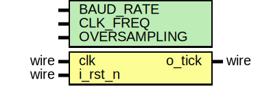

# Entity: baudrate_generator 
- **File**: baudrate_generator.v

## Diagram

## Generics

| Generic name | Type | Value      | Description              |
| ------------ | ---- | ---------- | ------------------------ |
| BAUD_RATE    |      | 19200      | Velocidad de transmision |
| CLK_FREQ     |      | 50_000_000 | Frecuencia del reloj     |
| OVERSAMPLING |      | 16         | Oversampling             |

## Ports

| Port name | Direction | Type | Description                         |
| --------- | --------- | ---- | ----------------------------------- |
| clk       | input     | wire | Reloj                               |
| i_rst_n   | input     | wire | Reset                               |
| o_tick    | output    | wire | tick que se genera cada NC_PER_TICK |

## Signals

| Name    | Type                 | Description |
| ------- | -------------------- | ----------- |
| counter | reg [NB_COUNTER-1:0] | Contador    |

## Constants

| Name        | Type | Value                               | Description                 |
| ----------- | ---- | ----------------------------------- | --------------------------- |
| NC_PER_TICK |      | CLK_FREQ / BAUD_RATE / OVERSAMPLING | Numero de ciclos por tick   |
| NB_COUNTER  |      | (NC_PER_TICK - 1)                   | Numero de bits del contador |

## Functions
- clogb2 (input integer value; ) return (integer)

## Processes
- unnamed: ( @(posedge clk or negedge i_rst_n) )
  - **Type:** always
